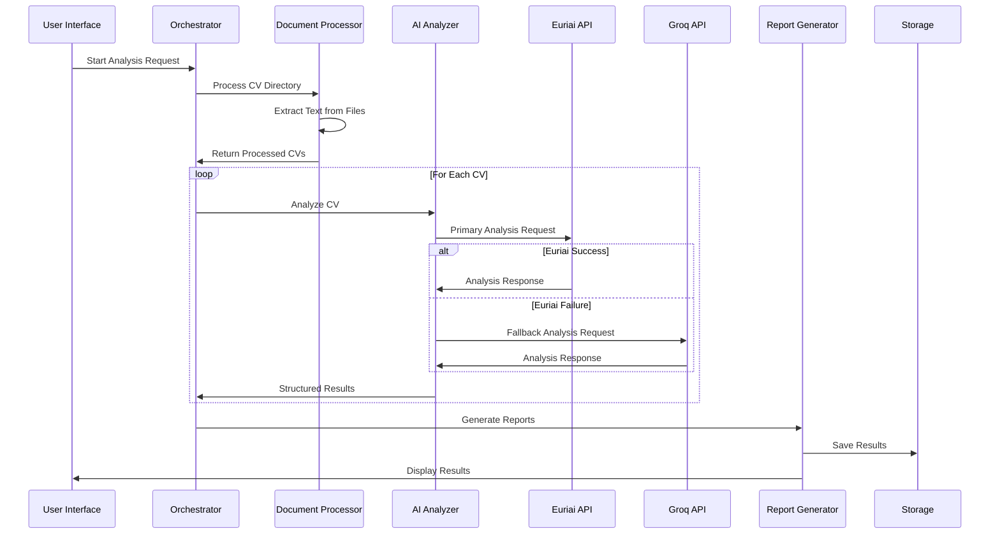
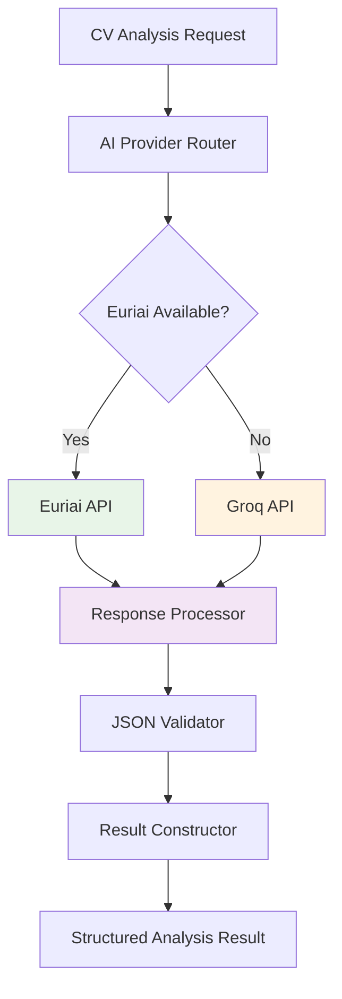
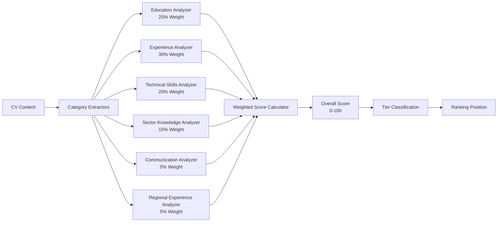

# 🏗️ System Architecture Documentation

## 📋 Overview

The MEL Manager CV Analysis System follows a modular, scalable architecture designed for enterprise-level recruitment operations. The system implements a multi-layered approach with clear separation of concerns, ensuring maintainability, testability, and extensibility.

## 🎯 Architectural Principles

### **Design Philosophy**
- **Modularity**: Each component has a single responsibility
- **Scalability**: Designed to handle enterprise-level workloads
- **Reliability**: Dual AI provider architecture for 99.9% uptime
- **Security**: Local processing with secure API authentication
- **Maintainability**: Clean code structure with comprehensive documentation

### **Key Patterns**
- **Strategy Pattern**: Multiple AI providers with automatic failover
- **Factory Pattern**: Document processor creation based on file type
- **Observer Pattern**: Real-time progress tracking and updates
- **Repository Pattern**: Centralized data access and management

## 🏛️ System Layers

### **1. Presentation Layer**
```
📱 Streamlit Web Interface (mel_cv_analyzer.py)
├── User Authentication & Configuration
├── File Upload & Management Interface
├── Real-time Progress Monitoring
├── Results Visualization & Analytics
└── Report Export & Download
```

**Responsibilities:**
- User interface and experience
- Input validation and sanitization
- Progress tracking and status updates
- Results presentation and visualization

### **2. Business Logic Layer**
```
🧠 Core Processing Engine
├── CV Analysis Orchestration
├── Scoring & Ranking Algorithms
├── Business Rules Implementation
└── Workflow Management
```

**Components:**
- **MELCVAnalysisSystem**: Main orchestration class
- **Scoring Engine**: Weighted evaluation algorithms
- **Ranking System**: Candidate tier classification
- **Workflow Manager**: Process coordination

### **3. Service Layer**
```
🔧 Utility Services
├── AI Analysis Service (ai_analyzer_clean.py)
├── Document Processing Service (document_processor.py)
├── Report Generation Service (report_generator.py)
└── API Client Service (euri_client.py)
```

**Service Details:**

#### **AI Analysis Service**
- **Primary Provider**: Euriai API integration
- **Fallback Provider**: Groq API integration
- **Prompt Engineering**: MEL-specific analysis prompts
- **Response Processing**: JSON parsing and validation

#### **Document Processing Service**
- **Multi-format Support**: PDF, DOCX, DOC processing
- **Text Extraction**: Advanced content extraction
- **Error Handling**: Robust file processing with fallbacks
- **Batch Processing**: Efficient bulk operations

#### **Report Generation Service**
- **Excel Export**: Multi-sheet workbooks with analytics
- **JSON Export**: Structured data for integration
- **Dashboard Integration**: Real-time data visualization
- **Template Management**: Customizable report formats

### **4. Data Access Layer**
```
💾 Data Management
├── File System Operations
├── Configuration Management
├── Results Persistence
└── Cache Management
```

**Responsibilities:**
- File I/O operations
- Configuration loading and validation
- Results storage and retrieval
- Temporary data management

## 🔄 Data Flow Architecture



## 🤖 AI Provider Architecture

### **Dual Provider Strategy**



### **Provider Specifications**

#### **Primary Provider: Euriai**
- **Endpoint**: `https://api.euron.one/api/v1/euri/alpha/chat/completions`
- **Models**: GPT-4.1-nano, Gemini-2.0-flash-001, LLaMA-4-maverick
- **Authentication**: Bearer token
- **Rate Limits**: Configurable with intelligent backoff
- **Advantages**: Multiple model options, competitive pricing

#### **Fallback Provider: Groq**
- **Model**: LLaMA3-70B-8192
- **Authentication**: API key
- **Rate Limits**: High throughput with automatic retry
- **Advantages**: High speed, reliable performance

## 📊 Scoring Engine Architecture

### **Weighted Evaluation System**



### **Scoring Algorithm**

```python
def calculate_weighted_score(category_scores: Dict[str, float]) -> float:
    """
    Calculate overall weighted score based on category performance
    
    Formula: Σ(category_score × weight) / total_weight × 100
    """
    weights = {
        "education": 0.25,
        "experience": 0.30,
        "technical_skills": 0.20,
        "sector_knowledge": 0.15,
        "communication": 0.05,
        "regional_experience": 0.05
    }
    
    total_score = sum(
        category_scores.get(category, 0) * weight 
        for category, weight in weights.items()
    )
    
    return min(100, max(0, total_score))
```

## 🔒 Security Architecture

### **Security Layers**

1. **API Security**
   - Bearer token authentication
   - Secure HTTPS communication
   - API key rotation support
   - Rate limiting and throttling

2. **Data Security**
   - Local document processing
   - No external data storage
   - Secure temporary file handling
   - Automatic cleanup procedures

3. **Application Security**
   - Input validation and sanitization
   - Error handling without data exposure
   - Secure configuration management
   - Audit logging capabilities

## 📈 Performance Architecture

### **Optimization Strategies**

1. **Concurrent Processing**
   - Asynchronous CV analysis
   - Configurable concurrency limits
   - Intelligent rate limiting

2. **Memory Management**
   - Streaming document processing
   - Garbage collection optimization
   - Memory-efficient data structures

3. **Caching Strategy**
   - API response caching
   - Document processing cache
   - Configuration caching

### **Scalability Considerations**

- **Horizontal Scaling**: Multiple instance deployment
- **Vertical Scaling**: Resource optimization
- **Load Balancing**: Request distribution
- **Database Scaling**: Future database integration

## 🔧 Configuration Architecture

### **Environment Configuration**

```yaml
# .env Configuration Structure
API_CONFIGURATION:
  EURI_API_KEY: "Bearer token for Euriai API"
  GROQ_API_KEY: "API key for Groq fallback"
  
PROCESSING_SETTINGS:
  MAX_CONCURRENT_REQUESTS: 2
  BATCH_SIZE: 50
  TEMPERATURE: 0.1
  MAX_TOKENS: 2000
  
SYSTEM_SETTINGS:
  CV_DIRECTORY: "CVs"
  RESULTS_DIRECTORY: "results"
  CHUNK_SIZE: 4000
  OVERLAP_SIZE: 200
```

### **Runtime Configuration**

- **Dynamic API Provider Selection**
- **Configurable Scoring Weights**
- **Adjustable Processing Parameters**
- **Customizable Report Templates**

## 🚀 Deployment Architecture

### **Local Deployment**
```
📦 Standalone Application
├── Python Environment (3.8+)
├── Streamlit Web Server
├── Local File System
└── API Client Libraries
```

### **Cloud Deployment** (Future)
```
☁️ Cloud Infrastructure
├── Container Orchestration (Docker/Kubernetes)
├── Load Balancer
├── Auto-scaling Groups
├── Managed Database
├── Object Storage
└── Monitoring & Logging
```

## 📊 Monitoring & Observability

### **Logging Architecture**
- **Application Logs**: Structured logging with levels
- **Performance Metrics**: Processing times and throughput
- **Error Tracking**: Comprehensive error capture
- **Audit Trails**: User actions and system events

### **Metrics Collection**
- **Processing Statistics**: Success rates, timing
- **API Performance**: Response times, error rates
- **Resource Utilization**: Memory, CPU usage
- **Business Metrics**: Candidate scores, rankings

## 🔮 Future Architecture Enhancements

### **Planned Improvements**

1. **Microservices Architecture**
   - Service decomposition
   - API gateway implementation
   - Service mesh integration

2. **Advanced AI Integration**
   - Custom model fine-tuning
   - Multi-modal analysis (images, videos)
   - Real-time learning capabilities

3. **Enterprise Features**
   - Multi-tenant architecture
   - Role-based access control
   - Advanced analytics dashboard

4. **Integration Capabilities**
   - REST API for external systems
   - Webhook notifications
   - Third-party ATS integration

---

*This architecture documentation provides a comprehensive overview of the system design, ensuring maintainability, scalability, and professional development standards.*
